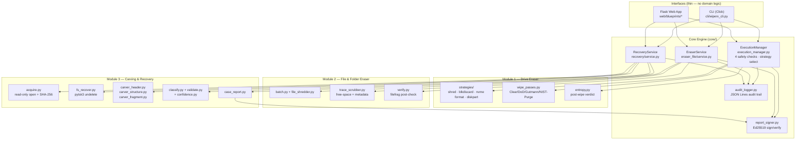

# Technical documentation

Architecture, data flow, security design, and test coverage for WiperX, written against the merged state of `main` (commit `eb1f159` and later) as of 2026-08-31.

## 1. Architecture



Every interface (CLI, web) delegates to one of three `service`-shaped orchestrators in `core/` — none of them contain wipe/erase/recovery logic themselves, matching the "thin interfaces" principle the original README established for Module 1 and extended here to Modules 2 and 3.

## 2. Data flow per module

### Module 1 — Secure Drive Eraser (`core/execution_manager.py::execute_wipe`)

1. Build an executor (`LocalExecutor` / `SSHExecutor` / `WinRMExecutor`) and detect the target OS.
2. **Safety Check 1** — privilege: `os.geteuid() == 0` (Linux) / `IsUserAnAdmin()` (Windows). Unconditional — cannot be bypassed for any target type.
3. Scan disks (`disk_scanner.py`), resolve the requested disk.
4. **Safety Check 2** — the operator must retype the exact disk identifier (anti-typo guard against wiping the wrong disk from muscle memory).
5. **Safety Check 3** — refuse if the disk is the running OS's system disk.
6. **Safety Check 4** — refuse if the disk or any partition is currently mounted.
7. Select a strategy (`strategies/__init__.py`, factory pattern keyed on OS + bus/disk type) and, if a non-default `--method` was given, resolve it to a `PassSpec` list via `wipe_passes.pass_spec()`.
8. Execute the strategy; `entropy.py` can sample the result afterward to independently verify the region actually reads as wiped rather than trusting the wipe command's exit code alone.
9. Build and sign a report (`report_generator.py` + `report_signer.py`), write the audit event.

### Module 2 — Secure File & Folder Eraser (`core/eraser_file/service.py::erase_paths`)

1. Capture each target's pre-erase extent map (for later verification) via `_capture_extent_map`.
2. `batch.shred_paths()` → per-file: overwrite N random passes (+ optional trailing zero pass) → rename through `rename_rounds` random names → unlink. Runs on a thread pool (`workers`).
3. Optionally clear free space on a mount (`trace_scrubber.wipe_free_space`) and `fstrim`.
4. `verify.py` samples former physical extents via `filefrag` (Linux + root only; reported as skipped elsewhere) to confirm the blocks were actually touched, not just the directory entry removed.
5. Build a report, sign it (`report_signer.write_signed_json`), write the audit event.

### Module 3 — Advanced File Carving & Recovery (`core/recovery/service.py::recover`)

1. `acquire.open_source()` opens the source **read-only** — a block device or a plain image file are handled identically; a read-write-mounted device is refused unless the caller explicitly overrides. The whole source is SHA-256 hashed once for the manifest.
2. Filesystem-aware pass (`fs_recover.py`, via `pytsk3`/Sleuth Kit) — walks the filesystem's own deleted-inode metadata to recover files the filesystem still knows about, unless `carve_only`.
3. Signature-carving pass (`carver_header.py`), unless `fs_only` — scans the source for known file-type headers (`signatures.py`) not already accounted for by the filesystem pass (`allocated_ranges` prevents double-recovery), determines each carve's end via footer match or structural refinement (`carver_structure.py`), with `carver_fragment.py` additionally handling bifragmented JPEGs (header/body split by a gap, common when a file is deleted and partially reused).
4. Every recovered record is enriched: `classify.py` (libmagic-based content typing), `validate.py` (structural validity per type — e.g. does the JPEG actually decode), `confidence.py` (a score derived from carve method + classification agreement + validation result).
5. `case_report.py` builds and Ed25519-signs the forensic case report; the audit log records the run.

## 3. Report signing scheme (`core/report_signer.py`)

Every report type — wipe, file-erase certificate, recovery case — is wrapped in the same signed envelope:

```json
{
  "payload":   { "...": "the original report dict" },
  "signature": {
    "alg": "Ed25519",
    "value": "<hex signature over the canonical payload>",
    "public_key": "<hex raw 32-byte Ed25519 public key>",
    "key_id": "<first 16 hex chars of sha256(public_key)>",
    "signed_at": "<ISO-8601 UTC>Z"
  }
}
```

**Canonicalization:** `json.dumps(payload, sort_keys=True, separators=(",", ":"))` — deterministic byte representation, so the signature is stable regardless of dict insertion order.

**Key management:** private key at `keys/wiperx_sign_key.pem` (mode `0600`, confirmed on disk), public half alongside as `keys/wiperx_sign_key.pub.pem`. If the private key file is absent on first run, a fresh Ed25519 identity is generated automatically — logged as a warning, since it means prior certificates won't chain to the new key. `WIPERX_SIGN_KEY` / `WIPERX_VERIFY_PUBKEY` env vars override the paths for production deployments where the signing key should come from a secrets manager rather than the repo checkout.

**Why Ed25519 over the HMAC the original README roadmap called for:** asymmetric signing means the public key can be distributed to auditors/judges who need to verify a certificate without ever holding the private signing key — HMAC would require sharing the same secret with every verifier, which is a weaker chain-of-custody story for a forensics tool.

## 4. Threat model — what each safety layer defends against

| Layer | Defends against |
|---|---|
| Module 1 privilege check (unconditional root/admin) | An unprivileged process or compromised low-privilege account triggering a destructive wipe |
| Module 1 disk-name retype confirmation | Operator fat-finger error — wiping the wrong disk because they clicked/typed the wrong identifier under time pressure |
| Module 1 system-disk block | Wiping the OS out from under the running system (would also just fail, but this fails safely and early with a clear message) |
| Module 1 mounted-disk block | Wiping a disk with an active filesystem still in use elsewhere on the machine |
| Recovery read-only source open + rw-mount refusal | The recovery tool itself corrupting the evidence it's meant to preserve — a forensic tool that can write to its own evidence source is not trustworthy |
| SHA-256 hash of the whole source, logged in the manifest | Establishes an integrity baseline for chain-of-custody — any later dispute about whether the source was altered can be checked against this hash |
| Ed25519 report signing | Tamper-evidence for every report — a report edited after signing fails verification, whether the tamperer is external or an insider with filesystem access to the reports directory |
| RBAC (Admin/Operator/Viewer, `web/models.py`) | Least privilege in the web UI — a Viewer can look at scans/reports but cannot initiate a wipe/erase/recovery or manage machines; enforced per-route via `current_user.can(...)` in every blueprint |
| SSH key-based auth only, WinRM HTTPS-only | Credential theft via password interception; `allow_agent=False`/`look_for_keys=False` on the SSH executor also prevents accidentally using an unintended key from the operator's own agent |
| Structured JSON audit logging (every module) | Non-repudiation and incident reconstruction — every wipe/erase/recovery run is logged with timestamp, operator, PID, hostname before and after execution, independent of whether the operation succeeded |
| LDAP search-then-bind, never bind-as-username directly | A generic LDAP or AD deployment where the directory doesn't permit that pattern; also means a compromised search/service account alone can't authenticate as another user — the real password check only ever happens via the user's own bind |
| LDAP filter-character escaping (`web/ldap_auth._escape`) | LDAP filter injection via a crafted username (e.g. `*` wildcards or unbalanced parens altering the search scope) |
| SIEM forwarder failures never raise into the caller | An unreachable/slow/misconfigured SIEM target degrading availability of the actual wipe/erase/recovery operation that produced the event being forwarded |

**Not defended against (documented limitations, not gaps in this analysis):** a malicious operator with legitimate Admin credentials — RBAC limits blast radius by role but an Admin can still wipe intentionally; SSD/flash wear-leveling meaning a software overwrite pass may not reach every physical cell (README already documents this, recommends hardware Secure Erase); the report-signing private key itself being compromised (standard PKI key-custody problem, out of scope for this tool); a compromised LDAP service account bind password (same class of problem as any password-based service account — not something an app-layer fix solves); the SIEM forwarder queue is in-process memory, so events queued but not yet delivered are lost on a process crash (best-effort delivery, not at-least-once).

## 5. Test-suite coverage (129 passing + 6 real-service-gated, all green)

| File | Tests | Area |
|---|---|---|
| `test_core.py` | 28 | OS detection, disk-info formatting, strategy factory selection (HDD/SSD/NVMe/USB/Windows/hdparm), execution-manager safety checks 2–3, local executor, DoD/Gutmann/ata-secure-erase pass-list routing, hdparm frozen-drive/unsupported-feature/failure handling |
| `test_eraser_file.py` | 8 | Single/large file erase, zero-rename-round edge case, nested directories, non-recursive skip, symlink-not-followed, permission-error handling (returns a result, not an exception), progress/sort ordering |
| `test_recovery.py` | 7 | Missing-source rejection, fragmented-JPEG reassembly, known-payload carving, signed+verifiable case report, deterministic manifest hashing, PNG structural validation, web case-view integration |
| `test_carver_fragment.py` | 7 | Contiguous byte-exact recovery, bifragment recovery at 3 gap sizes (deterministic per-call seeds — see the file's own comment for why), random-sized gap, garbage-region rejection, truncated-input (no EOI) rejection |
| `test_carver_structure.py` | 3 | End-of-file trimming, bad-input and unknown-structure-type rejection |
| `test_report_signer.py` | 7 | Canonicalization key-order independence, sign→verify round trip, tampered-payload detection, malformed-envelope handling, file round trip, non-JSON input, untrusted-key rejection |
| `test_signatures.py` | 6 | Header matching at offset 0 and at a non-zero `header_at`, exhaustive header-hit iteration, absolute-offset correctness, name/alias lookup, max-header-length coverage |
| `test_wipe_passes.py` | 8 | Pass-count correctness per method, DoD byte values, Gutmann pass shape, `PassSpec` immutability/hashability, case-insensitive method lookup, unknown-method rejection, invalid-spec rejection, method-list completeness |
| `test_entropy.py` | 6 | Shannon entropy bounds, zeroed/fixed-fill/random/low-entropy classification, empty-buffer edge case |
| `test_smart_check.py` | 5 | Healthy/failing drive parsing, smartctl-missing degrades to advisory (not fatal), unparseable output is inconclusive not a crash, log callback |
| `test_web.py` | 10 | Anonymous redirect, Admin page access, dashboard action cards, audit-log view, Viewer RBAC denial (recovery page + run + audit log), malformed recovery-run request, unknown-case 404, a filesystem-recovered (non-carved) record renders without a 500 |
| `test_db_backend.py` | 8 + 2† | SQLite: disabled-by-default, seed-once, seeded-password check, user/machine CRUD round trip via the `MutableMapping` proxy, missing-key `KeyError`, LDAP JIT-provisioning helper. †Postgres: same seed/login and machine round trip against a **real `postgres:16-alpine` container** — skipped unless `WIPERX_TEST_POSTGRES_URL` is set |
| `test_ldap_auth.py` | 15 + 4† | Config detection, LDAP filter-injection escaping, role-mapping precedence/case-insensitivity, `ldap3`-missing and unreachable-server degrade to `None` not an exception. †Real server: correct/wrong password, unknown user, group→role mapping — against a **real `osixia/openldap` container** — skipped unless `WIPERX_TEST_LDAP_URL` is set |
| `test_siem_forwarder.py` | 10 | Config detection, real local-HTTP-server delivery for both Splunk HEC and Elasticsearch bulk payload shapes (headers, body), both targets receiving the same event, `audit_logger.log_event()` itself reaching the forwarder, unreachable-target non-blocking behavior, queue-full drop-without-raising |

Run with `pytest tests/ -v`; see `docs/PERFORMANCE_EVALUATION.md` for a benchmark-oriented view of what the passing tests actually measure in terms of throughput and accuracy, not just pass/fail.
