# User manual

A walkthrough for an operator with no development background: install, log in, scan, wipe a drive, securely erase files/folders, recover deleted evidence, and verify a certificate. Every screenshot below is a real capture of the running application (Flask dev server, `python run.py`), not a mockup.

## 1. Install and start

```bash
git clone https://github.com/harishvidyarthcsecs/WiperX
cd WiperX
python -m venv venv && source venv/bin/activate
pip install -r requirements.txt
export WIPERX_SECRET_KEY="pick-a-strong-random-key"
python run.py
```

Open `http://127.0.0.1:5000` in a browser.

## 2. Log in

Default credentials are `admin` / `admin123` — **change this before any real deployment** (see `docs/TECHNICAL_DOCUMENTATION.md` §4 for the RBAC model).

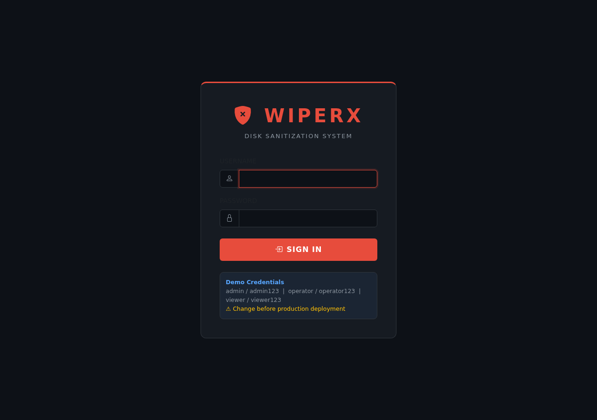

## 3. The dashboard

After logging in you land on the dashboard: three module cards (Drive Eraser, File Eraser, Recover), live counters, and a recent-activity feed pulled from the audit log.

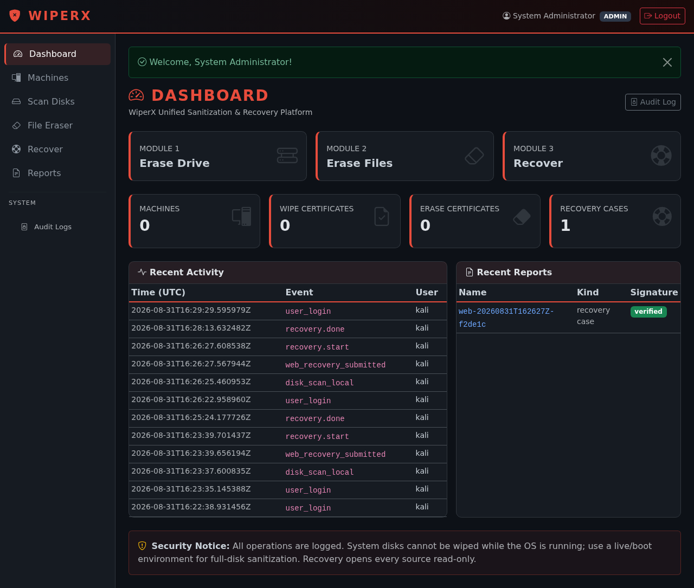

Click **Audit Log** any time to see every action taken on the system — every wipe, erase, recovery, and login is recorded here, independent of whether the operation succeeded.

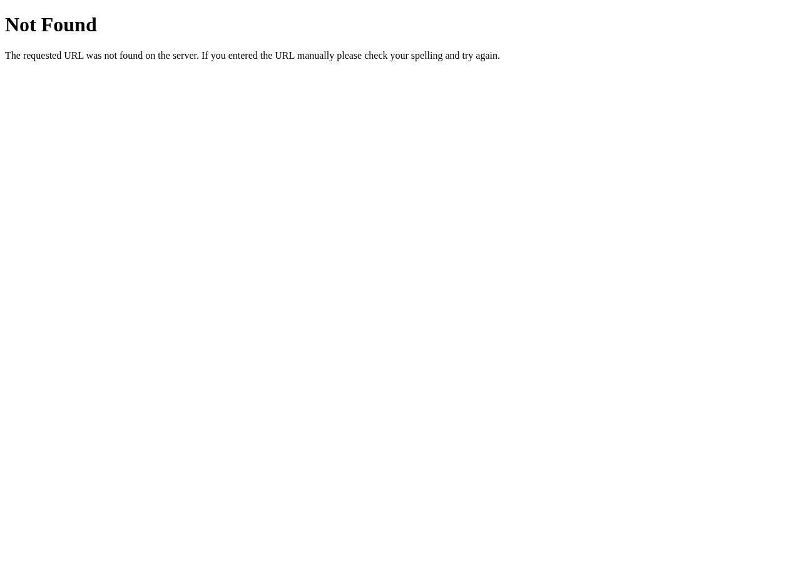

## 4. Register a remote machine (optional)

To wipe a *remote* disk over SSH (Linux) or WinRM (Windows), register the machine first under **Machines**. For local-only use, skip this section entirely.

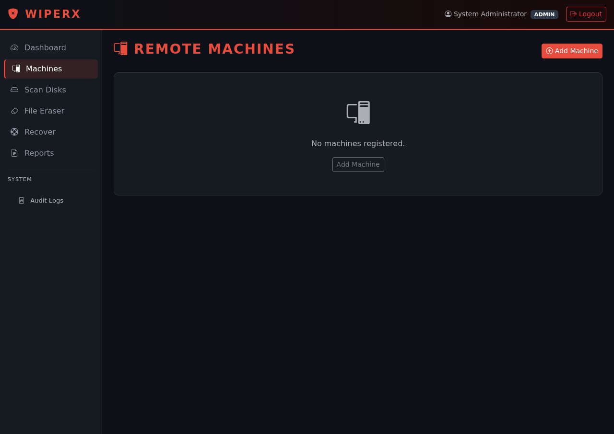
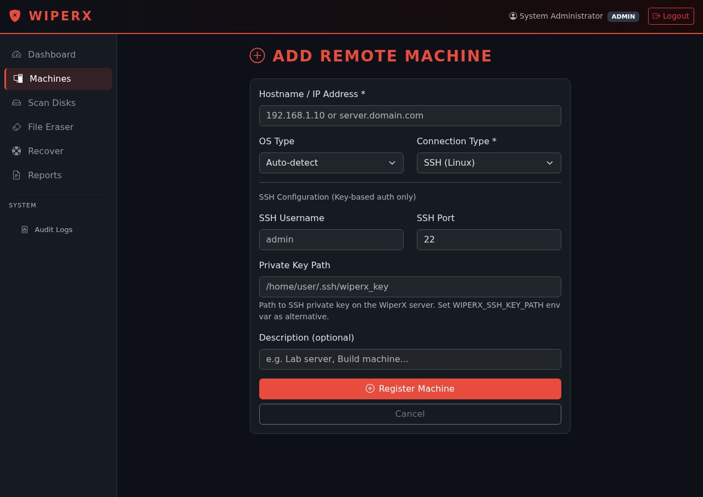

## 5. Scan disks

**Scan Disks** lists every disk WiperX can see — local by default, or a registered remote machine. The system disk is always marked **SYSTEM** and cannot be wiped; WiperX refuses this at the safety-check layer, not just in the UI.

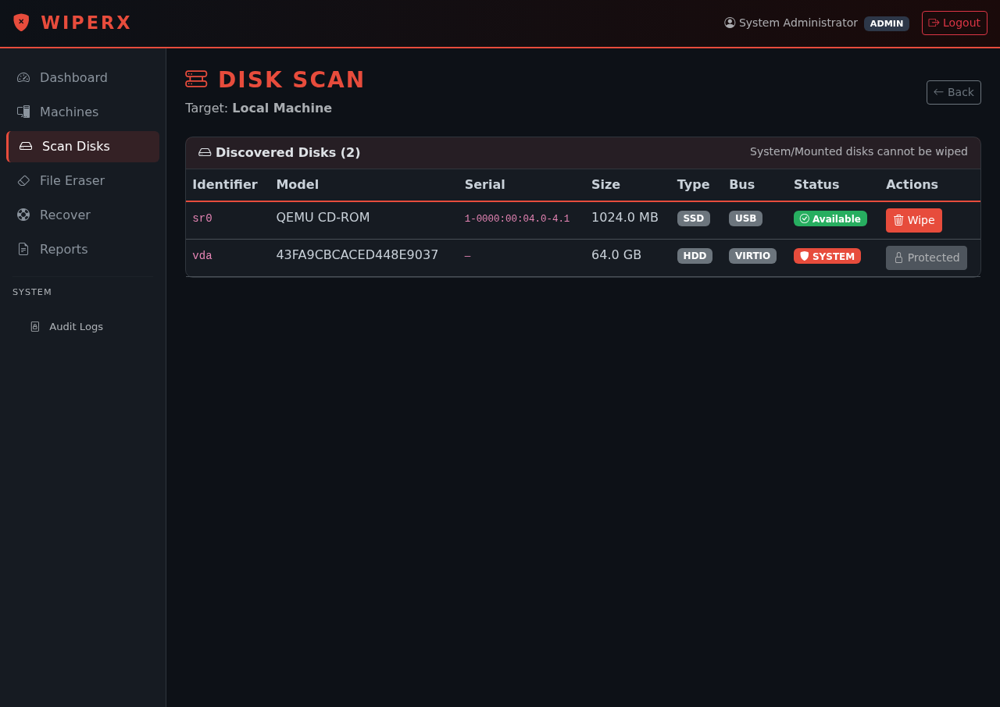

Click **Wipe** next to an available disk to start the drive-eraser flow (double confirmation, retype the disk name, choose a pass method — Clear / DoD / Gutmann / NIST-Purge — described in `docs/TECHNICAL_DOCUMENTATION.md`).

## 6. Secure File & Folder Eraser (Module 2)

For destroying specific files or folders rather than a whole disk — case files after a matter closes, an old export, anything you want gone without touching the rest of the drive.

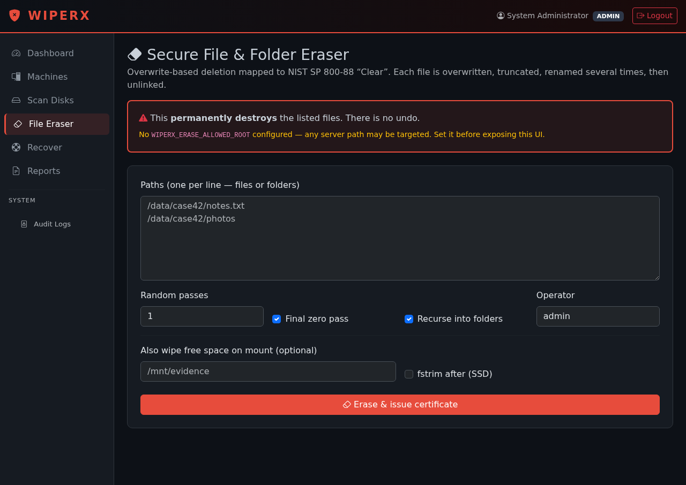

Enter one path per line, choose the number of random overwrite passes, and submit. **This permanently destroys the listed files — there is no undo**, which is why the form makes you confirm before it runs. The result page shows exactly what happened per file, and issues a signed JSON certificate you can hand to an auditor.

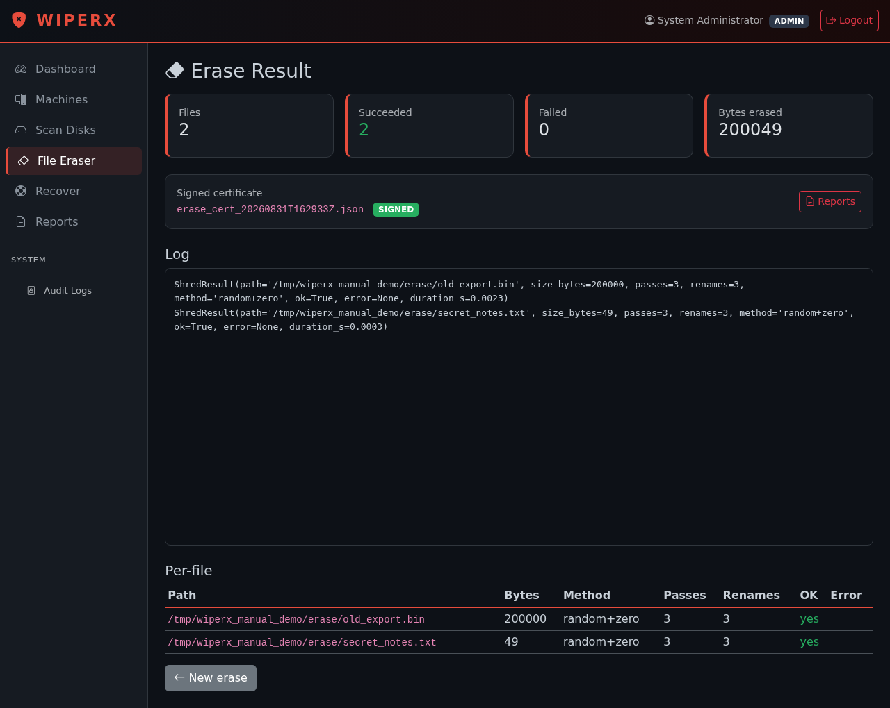

You can also wipe **free space** on a mount (useful after files were already deleted the ordinary way, to overwrite what they left behind) from the same form.

## 7. Advanced File Carving & Recovery (Module 3)

The forensic-recovery side: point WiperX at a device or image file and it recovers what it can — both files the filesystem still remembers as deleted, and files it has to carve out of raw bytes by signature.

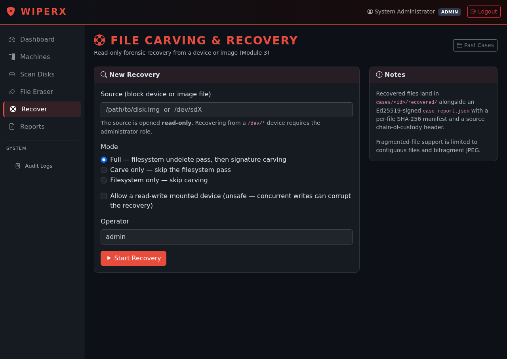

Submitting starts a background run with a live log stream — do not close the window while it's running. **Recovery is read-only**: WiperX never writes to the source, and the source is refused if it's a device currently mounted read-write (unless you explicitly override that).

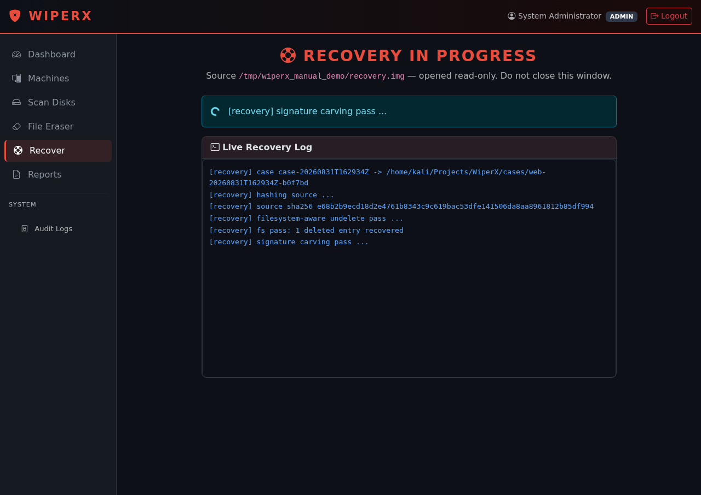

**A note on timing:** recovery throughput is roughly 0.5 MB/s on the current implementation (see `docs/PERFORMANCE_EVALUATION.md` for the real measured numbers and why) — a 48 MB image takes well over a minute. Budget for this on larger sources; it is not a hang.

Once done, the case appears under **Cases**:

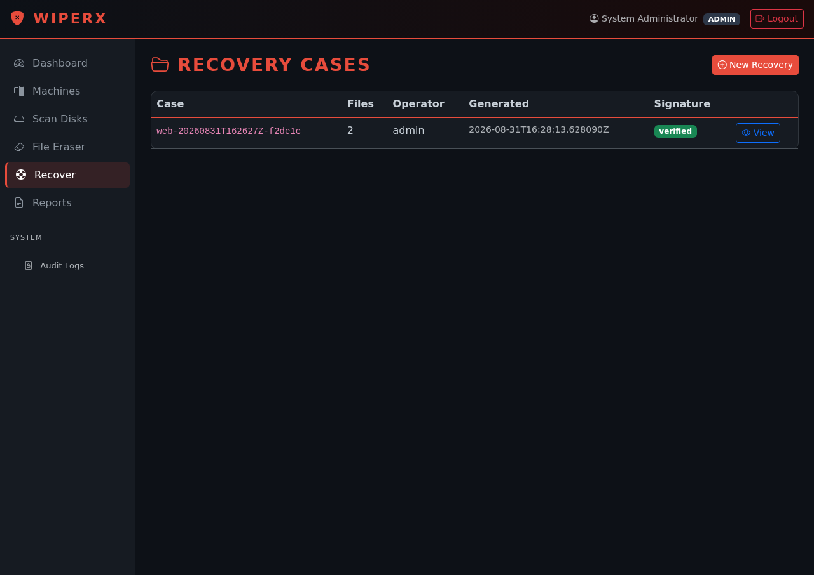

Open a case to see every recovered file with its category, validation state, and confidence score, plus a chain-of-custody block (source hash, read-only guarantee, read count) and a signature-verification badge on the report itself.

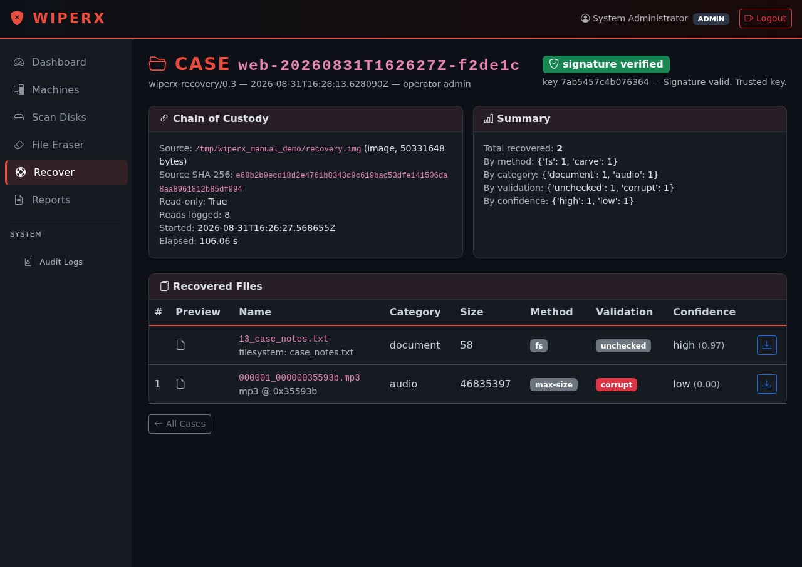

Reading this screen: a file recovered via the **filesystem-aware pass** (method `fs`) shows where it originally lived (`filesystem: <original path>`); a file recovered via **signature carving** (method varies, e.g. `max-size`) shows the signature type and byte offset it was found at instead, since carved files have no filesystem metadata to fall back on. Confidence score combines the recovery method, classification agreement, and structural validation — treat a **low** score (like the example above, an audio-signature false-positive on filesystem-internal bytes that failed MP3 structural validation) as "worth a human look," not as ground truth.

## 8. Reports

Every wipe, erase, and recovery run produces a report under **Reports** — JSON and (for drive wipes) PDF, each wrapped in a signed envelope (Ed25519). A green "signature verified" badge means the report hasn't been altered since it was generated; anyone with the public key (`keys/wiperx_sign_key.pub.pem`) can independently verify this without needing write access to the system.

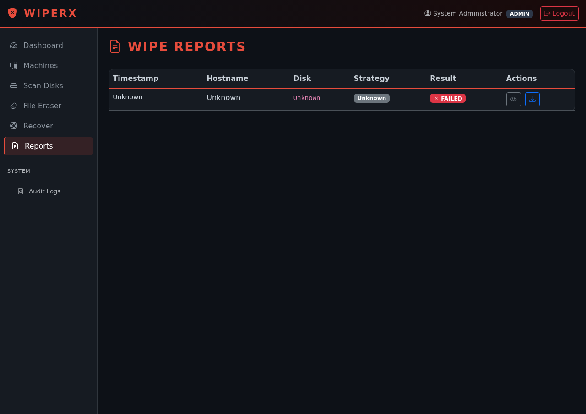

## 9. CLI, for scripting or headless use

Everything above is also available from the command line — useful for scheduled jobs or when there's no browser available:

```bash
sudo python -m cli.wiperx_cli scan --local
sudo python -m cli.wiperx_cli wipe sdb --local --method nist-purge --report-pdf
sudo python -m cli.wiperx_cli erase-file /data/case42/notes.txt --passes 3
sudo python -m cli.wiperx_cli erase-folder /data/case42/photos --passes 3
sudo python -m cli.wiperx_cli recover --source /dev/sdb1
python -m cli.wiperx_cli verify-report reports/erase_cert_20260831T162933Z.json
```

See `docs/TECHNICAL_DOCUMENTATION.md` for full architecture and `docs/SIH26149_GAP_ANALYSIS.md` for how this maps to the SIH26149 problem statement.
